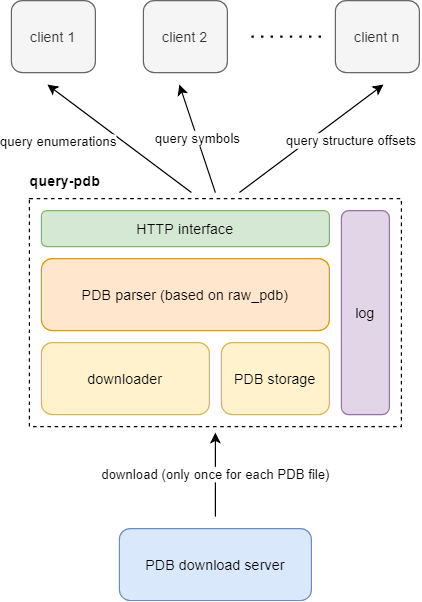
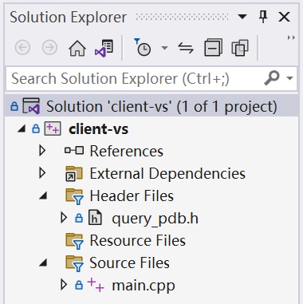
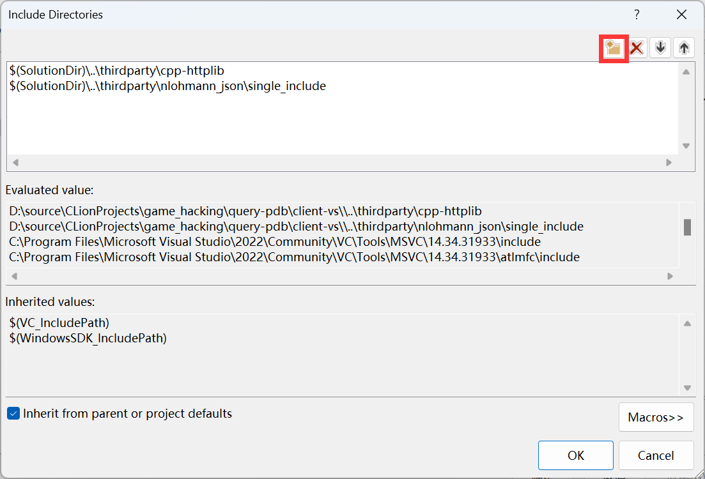

<p align="center">
    
    
</p>

# query-pdb

**query-pdb** is a server-side software for parsing PDB files. The software provides PDB online parsing service, the client only needs to send a request to the server to get the required structures and enumerations, and no longer needs to download the complete PDB file.



## Features

1. parse PDB online
2. fast PDB parsing engine
3. cache PDB file
4. exchange data via JSON

## Introduction

PDB file is a debugging symbol file for executable programs on windows platform, it records debugging information of executable programs, which includes structures, unions and enumerations. Microsoft provides public PDB files for a number of executables on the Windows platform, including **ntdll.dll**, **ntoskrnl.exe**, **win32k.sys**, and other executables.

Some kernel-level security software needs to parse the internal structure of the operating system, which may vary depending on the system version, so it needs to parse the current operating system executable on the machine and find the corresponding PDB file to get the exact data structure.

The traditional approach is to download the PDB file directly to the client and then parse it on the client side. However, since PDB files are often large (>10M), they consume large network traffic. The software provides PDB online parsing service, the client only needs to send a request to the server to get the required structures and enumerations, and no longer needs to download the complete PDB file.

## Quick Start

### Use the Public Test Server

The IP address of the public test server is http://39.105.177.215:9025

If you want to use this server, you can skip the next step.

**Notice**: Please do not use this server in a production environment, use your own server if needed.

### Run On Your Server

Download the version that matches your system from the GitHub release page and run it on your server.

Here are some command line configuration options for the software. You can also get help information with the `-h` option.

```
Usage:
  query-pdb [OPTION...]

      --ip arg      ip address (default: 0.0.0.0)
      --port arg    port (default: 8080)
      --path arg    download path (default: save)
      --server arg  download server (default:
                    http://msdl.microsoft.com/download/symbols/)
      --log         write log to file (1 means true, 0 means false)
  -h, --help        print help
```

When you successfully start the server, a similar message should be displayed.

```
[2023-02-13 21:36:01.888] [info] create downloader, path: save, server: http://msdl.microsoft.com/download/symbols/
```

If you are in China, there is a possibility that you cannot access Microsoft PDB server directly, you can use a mirror source instead. See [pdb_proxy](https://github.com/szdyg/pdb_proxy).

### Send Request Manually

You can send a **POST** request to your server to test if the server side is working properly. When parsing a PDB file that is not cached on the server for the first time, there may be a large delay because it needs to download the PDB file from the PDB storage server. Subsequent parsing requests will use the cached PDB file for parsing and will be fast.

1. get symbols (contain functions and global variables RVA)

send **POST** request to http://localhost:8080/symbol (replace with your IP and port)

(Don't worry about fields like `name`, `guid` and `age`, I'll explain them later.)

```
{
    "name": "ntkrnlmp.pdb",
    "guid": "8F0F3D677778391600F4EB2301FFC7A5",
    "age": 1,
    "query": [
        "KdpStub",
        "MmAccessFault",
        "xxxxxx"
    ]
}
```

Possible return results.

```
{
    "KdpStub": 3773768,
    "MmAccessFault": 2454256,
    "xxxxxx": -1
}
```

As you can see, when you request a name that exists, you get the correct result, and if you request a name that does not exist, -1 is returned. In several subsequent requests, we will still use -1 to represent invalid query results.

2. get structure offsets (include union)

send **POST** request to http://localhost:8080/struct (replace with your IP and port)

```
{
    "name": "ntkrnlmp.pdb",
    "guid": "8F0F3D677778391600F4EB2301FFC7A5",
    "age": 1,
    "query": {
        "_KPROCESS": [
            "UserTime",
            "DisableQuantum",
            "xxx"
        ],
        "xxx": [
            "xxx"
        ]
    }
}
```

Possible return results.

```
{
    "_KPROCESS": {
        "DisableQuantum": {
            "bitfield_offset": 2,
            "offset": 632
        },
        "UserTime": {
            "bitfield_offset": 0,
            "offset": 896
        },
        "xxx": {
            "bitfield_offset": 0,
            "offset": -1
        }
    },
    "xxx": {
        "xxx": {
            "bitfield_offset": 0,
            "offset": -1
        }
    }
}
```

3. get enumeration values

send **POST** request to http://localhost:8080/enum (replace with your IP and port)

```
{
    "name": "ntkrnlmp.pdb",
    "guid": "8F0F3D677778391600F4EB2301FFC7A5",
    "age": 1,
    "query": {
        "_OBJECT_INFORMATION_CLASS": [
            "ObjectTypeInformation",
            "xxx"
        ],
        "xxx": [
            "xxx"
        ]
    }
}
```

Possible return results.

```
{
    "_OBJECT_INFORMATION_CLASS": {
        "ObjectTypeInformation": 2,
        "xxx": -1
    },
    "xxx": {
        "xxx": -1
    }
}
```

### What about name, guid and age?

`name`, `guid` and `age` are important information used to find the PDB file corresponding to the executable. You can read them out directly from the PE format file. 

(The following code is not very strict and may access out of bounds when specific PE files are encountered.)

```c++
struct raw_debug_info {
    DWORD signature;
    GUID guid;
    DWORD age;
    char pdb_file_name[1];
};

pdb_path_info get_pdb_path_info() {
    auto p = const_cast<char *>(pe_.c_str());
    auto dos_header = reinterpret_cast<IMAGE_DOS_HEADER *>(p);
    auto nt_header = reinterpret_cast<IMAGE_NT_HEADERS *>(p + dos_header->e_lfanew);

    IMAGE_DATA_DIRECTORY *data_directory;
    switch (nt_header->FileHeader.Machine) {
        case IMAGE_FILE_MACHINE_I386:
            data_directory = reinterpret_cast<IMAGE_NT_HEADERS32 *>(nt_header)->
                OptionalHeader.DataDirectory;
            break;
        case IMAGE_FILE_MACHINE_AMD64:
            data_directory = reinterpret_cast<IMAGE_NT_HEADERS64 *>(nt_header)->
                OptionalHeader.DataDirectory;
            break;
        default:
            throw std::runtime_error("unsupported machine type");
    }
    auto debug_directory = reinterpret_cast<IMAGE_DEBUG_DIRECTORY *>(
        p + rva_to_offset(p, data_directory[IMAGE_DIRECTORY_ENTRY_DEBUG].VirtualAddress));
    auto raw = reinterpret_cast<raw_debug_info *>(p + debug_directory->PointerToRawData);

    return parse_raw_debug_info(raw);
}
```

### Send Request in C++

This is an [example](client/main.cpp). It relies on the following two open source repositories.

1. [nlohmann JSON](https://github.com/nlohmann/json) for constructing and parsing JSON
2. [httplib](https://github.com/yhirose/cpp-httplib) for sending requests

### Send Request in Other Languages

just do it yourself...

## Build

### CMake

The software is based on the CMake build system. If your computer does not have CMake, please install it. You can use the MSVC compiler on Windows and the gcc compiler on Linux.

Require:
1. CMake >= 3.24
2. OpenSSL >= 1.1.1

Typical build commands are as follows.

```bash
cd query-pdb
cmake -B build -DCMAKE_BUILD_TYPE=Release
cmake --build build --target query_pdb_server --config Release
```

If you wish to specify a compiler, or add cpp files, please refer to the CMake manual.

### Visual Studio

Since there are many Windows programmers who use Visual Studio for development, the software also provides a VS-based client project for programmers to easily apply the project to their projects. The Visual Studio solution is located in the `client-vs` folder in the root directory. Open the solution and you can compile and run the client application directly.

The project can be seen in Visual Studio's Solution Explorer as containing the source file `main.cpp` and the header file `query_pdb.h`. You can refer to main.cpp to learn how to use the PDB query functions provided by the `query_pdb.h` header file.



In addition to that, if you want to use `query_pdb.h` in your project you need to download and introduce the dependencies [nlohmann JSON](https://github.com/nlohmann/json) and [cpp-httplib](https://github.com/yhirose/cpp-httplib) for the header file `query_pdb.h` in the project property page.

`Properties -> VC++ Directories -> Include Directories -> Edit -> New Line`




## Send Request in Kernel Mode

The project provides an [example](client-drv/) of sending requests directly in kernel mode. I don't want to add too much code to the kernel layer because it might introduce additional instability, but sometimes it's more convenient to send a request directly in the kernel than to get the data in the application and send it to the driver.

This example is also written in C++ and it is based on the [ucxxrt](https://github.com/MiroKaku/ucxxrt) runtime library. With ucxxrt, we can write code in the kernel mode just like in the user mode.

Some codes.

```c++
try {
    kqpdb::set_default_server("http://39.105.177.215:9025/");
    kqpdb pdb("\\SystemRoot\\System32\\ntoskrnl.exe");

    ////////////////////////////////////////////////////////////////////////
    // query global offset
    {
        // method 1
        auto offset = pdb.get_symbol("KdpStub");
        DbgPrint("KdpStub: %x\n", offset);
    }

    ...

} catch (std::exception &e) {
    DbgPrint("[DriverMain] exception: %s\n", e.what());
} catch (...) {
    DbgPrint("[DriverMain] exception\n");
}
```

Possible outputs.

```
KdpStub: 2deb54
KdpStub: 2deb54
MmAccessFault: 2a4970
DirectoryTableBase: 28, 0
DirectoryTableBase: 28, 0
DisableQuantum: 278, 2
DirectoryTableBase: 28, 0
PagedPool: 1
PagedPool: 1
NonPagedPool: 0
PagedPool: 1
[DriverMain] start successfully
```

## Run In Docker

On servers, to provide isolation, services typically run in Docker. The `Dockerfile` is provided in the root of the repository for building Docker containers and `supervisord.conf` for configuring process monitoring.

There is a line of code in the `Dockerfile` for modifying the download source, you can remove this line if you don't need it.

```dockerfile
RUN sed -i 's/dl-cdn.alpinelinux.org/mirrors.aliyun.com/g' /etc/apk/repositories
```

You can modify `supervisord.conf` to customize the startup options.

```
[program:query-pdb-server]
command=/query-pdb/build/server/query_pdb_server <your options...>
autostart=true
autorestart=true
```

Once you have modified the `Dockerfile` and `supervisord.conf` files, you are ready to build the Docker container. You can use the following command to build and run.

If you do not understand the meaning of the following commands, please consult the Docker manual.

```
cd query-pdb
docker build -t zouxianyu/query-pdb-server .
docker run -p 80:8080 -itd zouxianyu/query-pdb-server
```

## Credits

- [cpp-httplib](https://github.com/yhirose/cpp-httplib): A C++ header-only HTTP/HTTPS server and client library
- [cxxopts](https://github.com/jarro2783/cxxopts): Lightweight C++ command line option parser
- [nlohmann JSON](https://github.com/nlohmann/json): JSON for Modern C++
- [raw_pdb](https://github.com/MolecularMatters/raw_pdb): A C++11 library for reading Microsoft Program DataBase PDB files
- [spdlog](https://github.com/gabime/spdlog): Fast C++ logging library.
- [pdb_proxy](https://github.com/szdyg/pdb_proxy): Microsoft PDB Proxy Server
- [dwm-screen-shot](https://github.com/lainswork/dwm-screen-shot): Provides ideas for using raw_pdb to parse PDB files
- [ucxxrt](https://github.com/MiroKaku/ucxxrt): The Universal C++ RunTime library, supporting kernel-mode C++ exception-handler and STL.
- [KSOCKET](https://github.com/wbenny/KSOCKET): KSOCKET provides a very basic example how to make a network connections in the Windows Driver by using WSK
- [httpparser](https://github.com/nekipelov/httpparser): HTTP request, response and urls parser